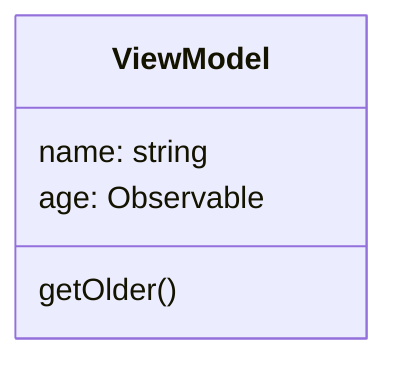
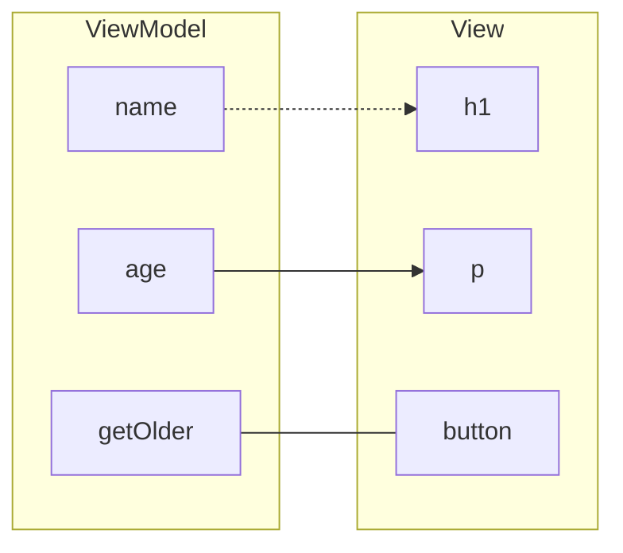

**John Smith** is a lightweight no-magic typescript frontend library for building interactive UI.

John Smith utilizes Model-View-ViewModel pattern where ***ViewModel*** is a class encapsulating core business logic:

```typescript
export class UserViewModel
{
    name = 'John Smith';
    
    age = new ObservableValue<number>(9);
    
    getOlder() {
        this.age.setValue(this.age.getValue());
    }
}
```

ViewModel can expose:

* static (often readonly) members;
* dynamic observable values;
* methods.



***View*** is a function that transforms a ViewModel to a fragment of a dynamic DOM tree. JSX syntax is used to define a view:

```jsx
export const UserView = (viewModel: UserViewModel) =>
    <section>
        <h1>{viewModel.name}</h1>

        Age: <p>{viewModel.age}</p>
        
        <button _click={() => viewModel.getOlder()}>One More Year Passed</button>
    </section>
```

Even though the code looks like react the meaning is different. JSX syntax is supported by TypeScript on language level and the JSX gets transformed to John Smith's special function call during the build time.

The View defines DOM structures and connects particular parts of the DOM to the observable properties of the corresponding ViewModel. This combination of HTML Elements and observable connections attached is called ***Dynamic DOM***: 



The last step would be ***rendering*** of the defined Dynamic DOM to an HTML Element:

```typescript
const
    application = new Application(),
    applicationViewModel = new ApplicationViewModel();

/**
 * Main entry point -- rendering the application
 * to #root element.
 */
application.render(
    'root', // we assume there is an element with id=root somewhere on the page
    ApplicationView,
    applicationViewModel);
```
